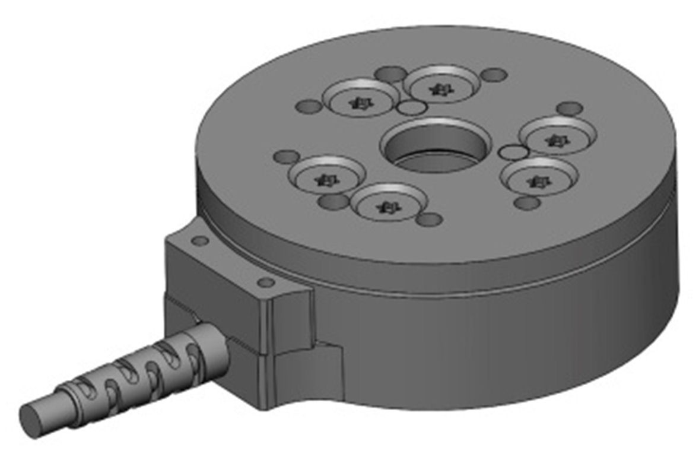

# ati_ft_sensor
<br>  
Interface using internet connexion to a ATI force torque sensor.

### Disclaimer 

This is a forked repo from [Ati_ft_sensor driver](https://github.com/open-dynamic-robot-initiative/ati_ft_sensor), so the original licenses and maintainers remain.

### Installation

#### Standard dependencies

This package is based on [ROS2](https://docs.ros.org/).
Currently based on ROS2 humble release.

#### Download the pacakge
```
  export COLCON_WS=~/workspace/ros2_ati_ft_sensor_ws
  mkdir -p $COLCON_WS/src
  cd $COLCON_WS
  git clone --branch sensor_pub_devel  https://github.com/UTNuclearRobotics/ati_ft_sensor.git src/ros2_ati_ft_sensor_ws
  ```

#### Pull relevant packages and install dependencies
```
vcs import src --skip-existing --input src/ros2_ati_ft_sensor_ws/ati_pub.repos
rosdep install --ignore-src --from-paths src -y -r
sudo apt-get install libedit-dev libncurses5
```

#### Compile and source the package

We use [colcon](https://github.com/machines-in-motion/machines-in-motion.github.io/wiki/use_colcon)
to build this package:
```
cd $COLCON_WS
colcon build --cmake-args -DCMAKE_BUILD_TYPE=Release
```

### Usage

#### Internet configuration & usage with rt_preempt

The ATI FT sensor is connected to the control PC via ethernet. To access the ATI sensor from the computer, the network connection to the ATI sensor must be configured. Refer to the [Ati_ft_sensor driver](https://github.com/open-dynamic-robot-initiative/ati_ft_sensor) for configuration instructions and for usage with rt_preempt.

#### Demos/Examples
To launch the node, run: 
  ```
  ros2 run ati_ft_sensor ati_ft_sensor_test_sensor
  ```
#### Ati Wrench Publisher
To publish wrenches on a /wrench_data topic, update the ip_address and the frame_id parameters in the config/ft_publisher.yaml file and run:
ros2 launch ati_ft_sensor ati_ft_sensor.launch.py

#### Faked Controller Wrench Publisher for Admittance Control
To control a visualization/simulation of a ROS2-enabled robot with data from the ati sensor, set the pub_faked_wrench parameter to True and launch the node. This will publish an additional Float64MultiArray std msg for admittance control. 

### Hardware specs
Refer to the [Ati_ft_sensor driver](https://github.com/open-dynamic-robot-initiative/ati_ft_sensor) for hardware specs. 

### Original Authors

- Ludovic Righetti
- Alexander Herzog

### License and Copyrights

License BSD-3-Clause
Copyright (c) 2019, New York University and Max Planck Gesellschaft.
